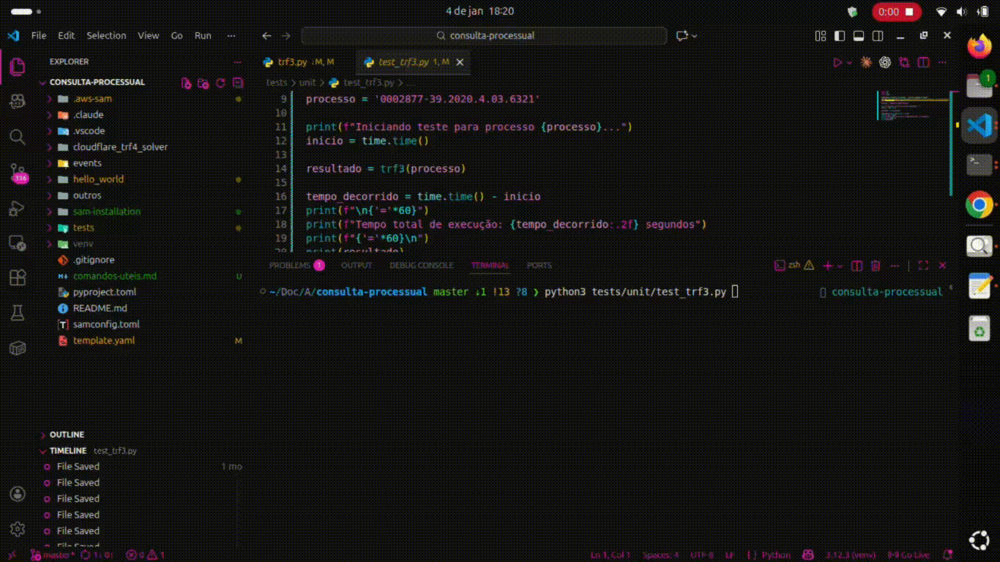

# Automação de Consultas em Tribunais Brasileiros

Sistema de automação para consulta de processos judiciais em tribunais brasileiros utilizando **web scraping**, **AWS Lambda** e técnicas avançadas de bypass de proteções anti-bot.

## 🎥 Demonstração



> **Sistema em ação**: Consulta automatizada de processos com bypass de CAPTCHA, extração de dados e processamento em AWS Lambda.

## Descrição

Este projeto implementa **crawlers (rastreadores web) avançados** para automatizar a consulta de processos judiciais em diversos tribunais brasileiros.

### 🚀 Destaques Técnicos

- **Web Scraping Avançado**: Utiliza **Requests** e **BeautifulSoup4** para extração eficiente de dados HTML
- **Bypass de CAPTCHAs**: Integração com **2Captcha** para resolução automática de:
  - Cloudflare Turnstile (TRF4)
  - reCAPTCHA
  - hCaptcha
- **Rotação de Proxies**: Suporte a proxies rotativos para evitar bloqueios e rate limiting
- **Parsing Dinâmico**: Extração inteligente de payloads e ViewStates de formulários JSF/PJe
- **Session Management**: Gerenciamento avançado de cookies e sessões HTTP
- **Serverless Architecture**: Deploy em AWS Lambda com containerização Docker

### 📊 Dados Extraídos

O sistema é capaz de extrair informações processuais de forma automatizada:

- Dados da capa do processo
- Movimentações processuais completas (com paginação)
- Partes envolvidas (autores, réus, advogados)
- Documentos anexos públicos (quando disponíveis)
- Histórico de classes processuais

## Tribunais Suportados

- **TRF3** - Tribunal Regional Federal da 3ª Região
- **TRF4** - Tribunal Regional Federal da 4ª Região
- **TJAC** - Tribunal de Justiça do Acre

## Tecnologias Utilizadas

- **Python 3.12**
- **AWS Lambda** - Execução serverless
- **AWS API Gateway** - Exposição da API REST
- **AWS SAM** - Deploy e gerenciamento da infraestrutura
- **Docker** - Containerização da aplicação
- **BeautifulSoup4** - Parsing de HTML
- **Requests** - Requisições HTTP
- **2Captcha** - Resolução de CAPTCHAs
- **Pytest** - Testes automatizados


## Configuração

### Pré-requisitos

- Python 3.12+
- Docker
- AWS CLI configurado
- SAM CLI
- Conta no serviço 2Captcha (para resolver CAPTCHAs)

### Instalação

1. Clone o repositório:
```bash
git clone <seu-repositorio>
cd automacao_tribunais
```

2. Crie um arquivo `.env` baseado no `.env.example`:
```bash
cp .env.example .env
```

3. Configure as variáveis de ambiente no arquivo `.env`:
```env
TWOCAPTCHA_API_KEY=sua_chave_api_aqui
AWS_API_URL=https://sua-api.execute-api.us-east-1.amazonaws.com/Prod/hello/
```

4. Instale as dependências:
```bash
cd hello_word
pip install -r requirements.txt
```

## Deploy na AWS

### Build da aplicação

```bash
sam build
```

### Deploy

```bash
sam deploy --guided
```

No primeiro deploy, o comando `--guided` vai te guiar pela configuração inicial.

## Testes

### Testes Locais

```bash
pytest tests/pytest/test_local.py -v
```

### Testes da API AWS

```bash
pytest tests/pytest/test_aws.py -v
```

## Uso

### Chamada da API

```bash
curl -X POST https://sua-api.execute-api.us-east-1.amazonaws.com/Prod/hello/ \
  -H "Content-Type: application/json" \
  -d '{"num_cnj": "0000001-11.2024.4.03.0000"}'
```

### Resposta Esperada

```json
{
  "statusCode": 200,
  "body": "{\"movimentos_processo\": \"DADOS DA CAPA DO PROCESSO:...\"}"
}
```

## Funcionamento dos Crawlers

### TRF4
- Resolve CAPTCHA Cloudflare Turnstile usando 2Captcha
- Extrai dados da capa e movimentos processuais
- Faz download de documentos públicos (limitado a 2 por requisição)

### TRF3
- Utiliza sistema PJe (Processo Judicial Eletrônico)
- Extrai payload dinamicamente do HTML
- Suporta paginação de movimentos

### TJAC
- Sistema e-SAJ
- Extração de partes do processo
- Histórico de classes

## Arquitetura AWS

```
API Gateway → Lambda Function → Crawlers → Tribunais
                ↓
         DynamoDB (cookies TRF4)
```

### Recursos AWS Criados

- **Lambda Function**: Executa os crawlers
- **API Gateway**: Endpoint REST público
- **DynamoDB Table**: Gerenciamento de cookies do TRF4
- **ECR Repository**: Armazena a imagem Docker
- **CloudWatch Logs**: Logs da aplicação

## Limitações

- Timeout de 60 segundos por requisição
- Alguns tribunais podem ter proteção anti-bot
- Números de processos fictícios são usados para demonstração
- Requer chave API do 2Captcha para TRF4

## Melhorias Futuras

- [ ] Adicionar mais tribunais (TJs e TRFs)
- [ ] Implementar cache de resultados
- [ ] Adicionar retry automático em caso de falha
- [ ] Melhorar tratamento de erros
- [ ] Adicionar validação de números CNJ
- [ ] Implementar rate limiting

## 💼 Competências Demonstradas

Este projeto demonstra domínio em:

### Backend & APIs

- Desenvolvimento de APIs REST com AWS API Gateway
- Arquitetura Serverless com AWS Lambda
- Integração com serviços AWS (DynamoDB, ECR, CloudWatch)

### Web Scraping & Automação

- Web scraping com Requests e BeautifulSoup4
- Bypass de proteções anti-bot (CAPTCHAs, rate limiting)
- Engenharia reversa de formulários web complexos (JSF, PJe)
- Gerenciamento de sessões e cookies HTTP
- Rotação de proxies para evitar bloqueios

### DevOps & Cloud

- Containerização com Docker
- Infrastructure as Code com AWS SAM
- CI/CD e deploy automatizado
- Gerenciamento de ambientes e variáveis de configuração

### Qualidade de Código

- Testes automatizados com Pytest
- Tratamento robusto de erros e exceções
- Logging estruturado para debugging
- Documentação técnica completa


